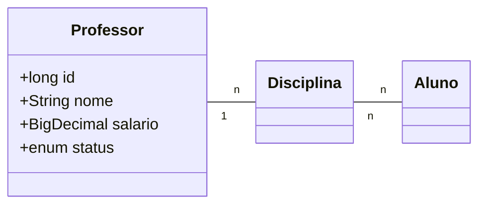

# SpringMVC-demo
Demo project made for learning purposes using Java and Spring MVC framework that follows the MVC architectural design pattern.

**Spring MVC** is a **web application framework** that is part of the **Spring Framework**. It is designed to make it easy to build web applications using the **Model-View-Controller (MVC) design pattern**.

In Spring MVC, the application is divided into **three main components: the Model, the View, and the Controller**. The **Model** represents the **data** and the **business logic** of the application, the **View** is responsible for **generating the HTML** that is sent to the client’s web browser, and the **Controller** acts as an **intermediary between the Model and the View**, **handling incoming HTTP requests and generating the appropriate response**.

## Technologies Used
* Java 21
* Spring boot 3.2.4
* Bootstrap 4.4.1
* PostgreSQL 16.2
* Maven

### Dependencies

Dependency | Description
--- | ---
**Spring Web** | Build web, including RESTful, applications using Spring MVC. Uses Apache Tomcat as the default embedded container.
**Spring Boot DevTools** | Provides fast application restarts, LiveReload, and configurations for enhanced development experience.
**Thymeleaf** | A modern server-side Java template engine for both web and standalone environments. Allows HTML to be correctly displayed in browsers and as static prototypes.
**Spring Data JPA** | Persist data in SQL stores with Java Persistence API using Spring Data and Hibernate.
**PostgreSQL Driver** | A JDBC and R2DBC driver that allows Java programs to connect to a PostgreSQL database using standard, database independent Java.
**Validation** | Bean Validation with Hibernate validator.

## Class Diagram

