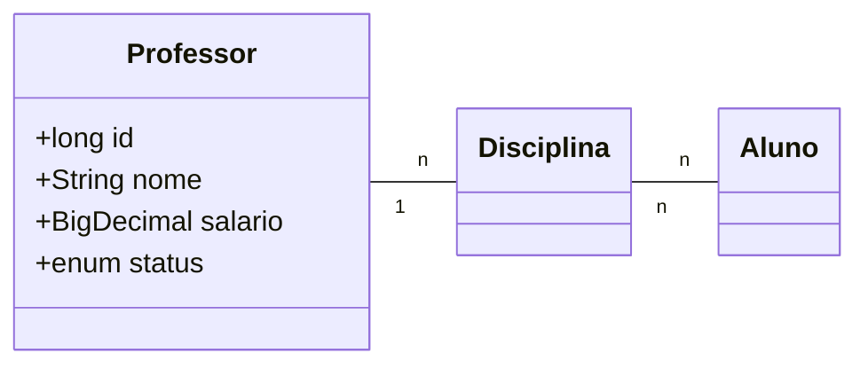

# SpringMVC-demo
Demo project made for learning purposes using Java and Spring MVC framework that follows the Model-View-Controller architectural design pattern.&ensp;

The **Model-View-Controller (MVC) framework** is an architectural/design pattern that separates an application into three main logical components Model, View, and Controller. Each architectural component is built to handle specific development aspects of an application.

## Technologies Used
* Java 21
* Spring boot 3.2.4
* Bootstrap 4.4.1
* PostgreSQL 16.2
* Maven

### Dependencies

[**Spring Web**] | Build web, including RESTful, applications using Spring MVC. Uses Apache Tomcat as the default embedded container.
[**Spring Boot DevTools**] | Provides fast application restarts, LiveReload, and configurations for enhanced development experience.
[**Thymeleaf**] | A modern server-side Java template engine for both web and standalone environments. Allows HTML to be correctly displayed in browsers and as static prototypes.
[**Spring Data JPA**] | Persist data in SQL stores with Java Persistence API using Spring Data and Hibernate.
[**PostgreSQL Driver**] | A JDBC and R2DBC driver that allows Java programs to connect to a PostgreSQL database using standard, database independent Java.

## Class Diagram

