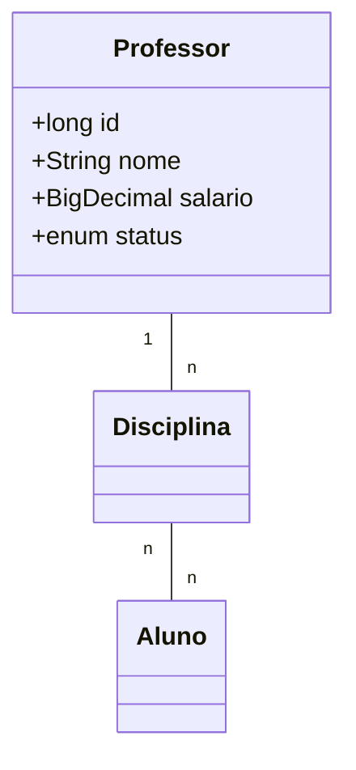

# SpringMVC-demo
Training Project in Java using Spring MVC framework that follows the Model-View-Controller architectural design pattern.

**Technologies**
    - Java 22
    - Spring boot 3.2.4
    - MySQL
    - Maven

**Dependencies**
    - Spring Web: Build web, including RESTful, applications using Spring MVC. Uses Apache Tomcat as the default embedded container.
    - Spring Boot DevTools: Provides fast application restarts, LiveReload, and configurations for enhanced development experience.
    - Thymeleaf: A modern server-side Java template engine for both web and standalone environments. Allows HTML to be correctly displayed in browsers and as static prototypes.
    - Spring Data JPA: Persist data in SQL stores with Java Persistence API using Spring Data and Hibernate.
    - MySQL Driver: MySQL JDBC driver. 

